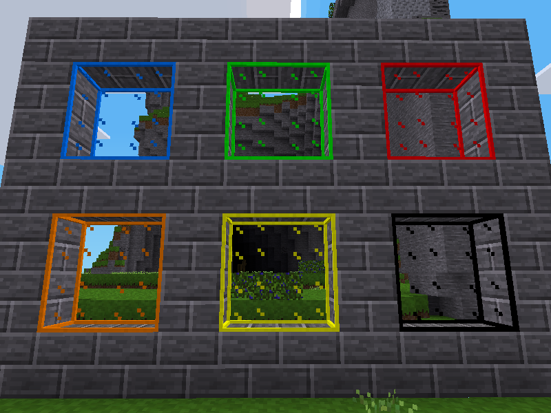

## Glass Mod for Minetest

### Description:

[Minetest][] mod that makes [default glass nodes][default] colorable with *unifieddyes:airbrush*.

### Licensing:

- Code:     [MIT](LICENSE.txt)
- Textures: multiple (see following table)

#### Texture Sources:

| Filename              | Author      | License | Source      |
| --------------------- | ----------- | ------- | ----------- |
| glass_plain           | Krock       | CC0     | [default][] |
| glass_plain_detail    | Krock       | CC0     | [default][] |
| glass_plain_edge      | Krock       | CC0     | [xpanes][]  |
| glass_obsidian        | AntumDeluge | CC0     | glass       |
| glass_obsidian_detail | AntumDeluge | CC0     | glass       |

### Dependencies:

Required:
- [default][]
- [unifieddyes][]

### Links:

- [][ContentDB]
- [Forum](https://forum.minetest.net/viewtopic.php?t=18307)
- [Git repo](https://github.com/AntumMT/mod-glass)
- [Changelog](changelog.txt)
- [TODO](TODO.txt)

[Minetest]: http://www.minetest.net/
[ContentDB]: https://content.minetest.net/packages/AntumDeluge/glass/

[default]: https://github.com/minetest/minetest_game/tree/master/mods/default
[xpanes]: https://github.com/minetest/minetest_game/tree/master/mods/xpanes

[unifieddyes]: https://forum.minetest.net/viewtopic.php?t=2178
